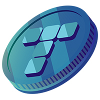

# Welcome!

## What is Tolpay!

TolPay is a trusted cryptocurrency compatible with BSC smart contract functions within the BSC Blockchain network, working in integration with high-performance trading tools, Tolpay provides users with the most efficient trading experience.

Unlike apps that force traditional money to be invested in cryptocurrencies, Tolpay is completely dedicated to cryptocurrencies.

It offers a real crypto investment/payment opportunity using blockchain technologies.

This makes it possible for the tokens used on our platforms to gain value like other investments of users, allowing them to  earn extra income and to get reduced transaction fees indirectly.

