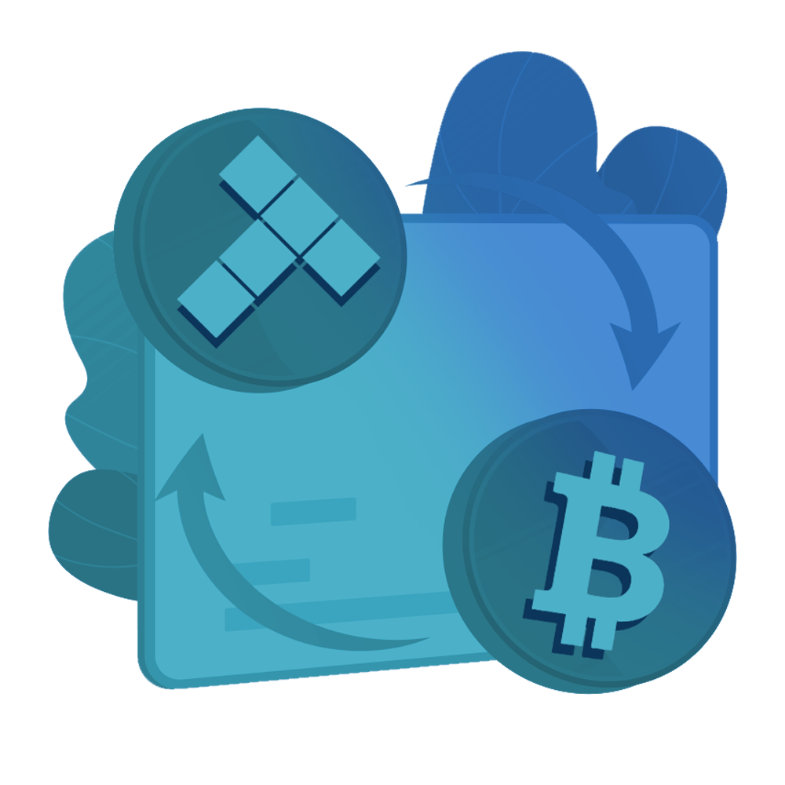

# Swap

Swap is an in-wallet crypto-to-crypto exchange. Swap allows users to easily exchange one cryptocurrency for another without leaving their wallet.

TolpaySwap, plans to make Tolpay transfers between users through the platforms it will create and working to develop the crypto exchanging system

